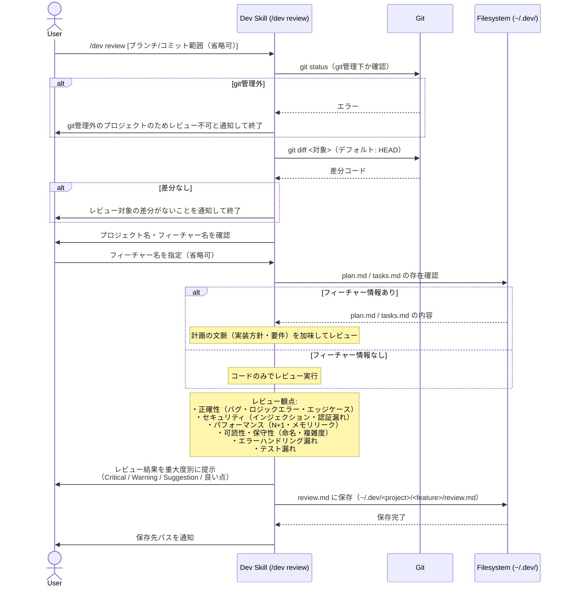

# Sequence - dev-review-cmd

```mermaid
sequenceDiagram
    actor User
    participant Skill as Dev Skill (/dev review)
    participant Git as Git
    participant FS as Filesystem (~/.dev/)

    User->>Skill: /dev review [ブランチ/コミット範囲（省略可）]

    Skill->>Git: git status（git管理下か確認）
    alt git管理外
        Git-->>Skill: エラー
        Skill->>User: git管理外のプロジェクトのためレビュー不可と通知して終了
    end

    Skill->>Git: git diff <対象>（デフォルト: HEAD）
    Git-->>Skill: 差分コード

    alt 差分なし
        Skill->>User: レビュー対象の差分がないことを通知して終了
    end

    Skill->>User: プロジェクト名・フィーチャー名を確認
    User->>Skill: フィーチャー名を指定（省略可）

    Skill->>FS: plan.md / tasks.md の存在確認
    alt フィーチャー情報あり
        FS-->>Skill: plan.md / tasks.md の内容
        Note over Skill: 計画の文脈（実装方針・要件）を加味してレビュー
    else フィーチャー情報なし
        Note over Skill: コードのみでレビュー実行
    end

    Note over Skill: レビュー観点:<br/>・正確性（バグ・ロジックエラー・エッジケース）<br/>・セキュリティ（インジェクション・認証漏れ）<br/>・パフォーマンス（N+1・メモリリーク）<br/>・可読性・保守性（命名・複雑度）<br/>・エラーハンドリング漏れ<br/>・テスト漏れ

    Skill->>User: レビュー結果を重大度別に提示<br/>（Critical / Warning / Suggestion / 良い点）

    Skill->>FS: review.md に保存（~/.dev/<project>/<feature>/review.md）
    FS-->>Skill: 保存完了
    Skill->>User: 保存先パスを通知
```
