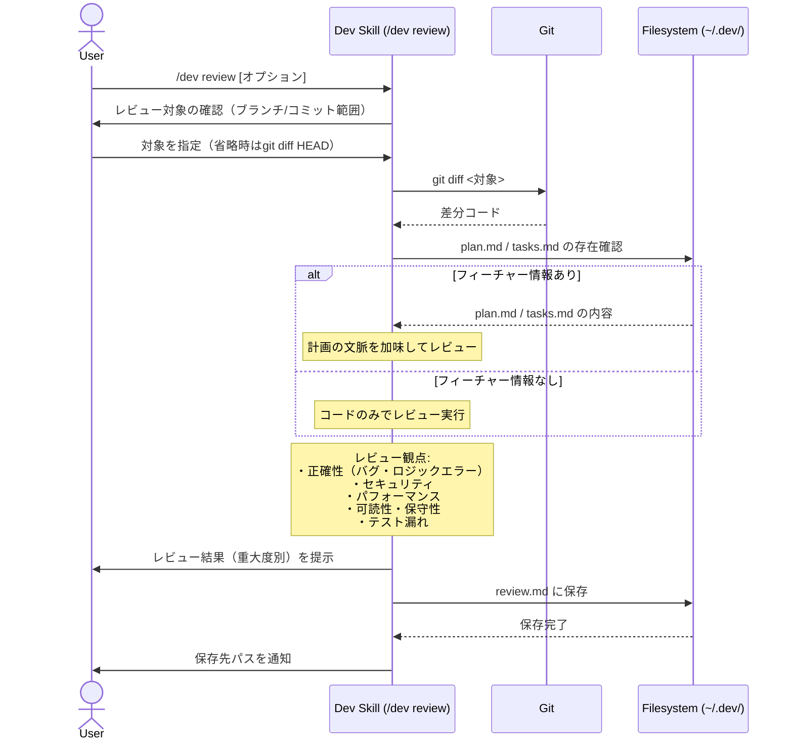

# Sequence - dev-review-cmd

```mermaid
sequenceDiagram
    actor User
    participant Skill as Dev Skill (/dev review)
    participant Git as Git
    participant FS as Filesystem (~/.dev/)

    User->>Skill: /dev review [オプション]
    Skill->>User: レビュー対象の確認（ブランチ/コミット範囲）
    User->>Skill: 対象を指定（省略時はgit diff HEAD）

    Skill->>Git: git diff <対象>
    Git-->>Skill: 差分コード

    Skill->>FS: plan.md / tasks.md の存在確認
    alt フィーチャー情報あり
        FS-->>Skill: plan.md / tasks.md の内容
        Note over Skill: 計画の文脈を加味してレビュー
    else フィーチャー情報なし
        Note over Skill: コードのみでレビュー実行
    end

    Note over Skill: レビュー観点:<br/>・正確性（バグ・ロジックエラー）<br/>・セキュリティ<br/>・パフォーマンス<br/>・可読性・保守性<br/>・テスト漏れ

    Skill->>User: レビュー結果（重大度別）を提示
    Skill->>FS: review.md に保存
    FS-->>Skill: 保存完了
    Skill->>User: 保存先パスを通知
```
