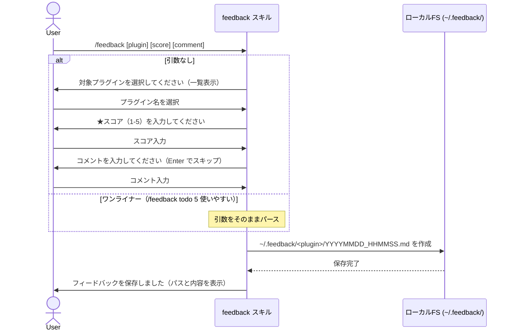
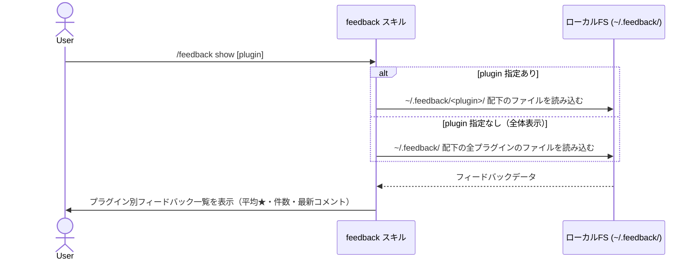

# Sequence - feedback-collection

## フィードバック送信フロー

```mermaid
sequenceDiagram
    actor User
    participant Skill as feedback スキル
    participant FS as ローカルFS (~/.feedback/)

    User->>Skill: /feedback [plugin] [score] [comment]

    alt 引数なし
        Skill->>User: 対象プラグインを選択してください（一覧表示）
        User->>Skill: プラグイン名を選択
        Skill->>User: ★スコア（1-5）を入力してください
        User->>Skill: スコア入力
        Skill->>User: コメントを入力してください（Enter でスキップ）
        User->>Skill: コメント入力
    else ワンライナー（/feedback todo 5 使いやすい）
        Note over Skill: 引数をそのままパース
    end

    Skill->>FS: ~/.feedback/<plugin>/YYYYMMDD_HHMMSS.md を作成
    FS-->>Skill: 保存完了
    Skill->>User: フィードバックを保存しました（パスと内容を表示）
```

## フィードバック閲覧フロー

```mermaid
sequenceDiagram
    actor User
    participant Skill as feedback スキル
    participant FS as ローカルFS (~/.feedback/)

    User->>Skill: /feedback show [plugin]

    alt plugin 指定あり
        Skill->>FS: ~/.feedback/<plugin>/ 配下のファイルを読み込む
    else plugin 指定なし（全体表示）
        Skill->>FS: ~/.feedback/ 配下の全プラグインのファイルを読み込む
    end

    FS-->>Skill: フィードバックデータ
    Skill->>User: プラグイン別フィードバック一覧を表示（平均★・件数・最新コメント）
```
