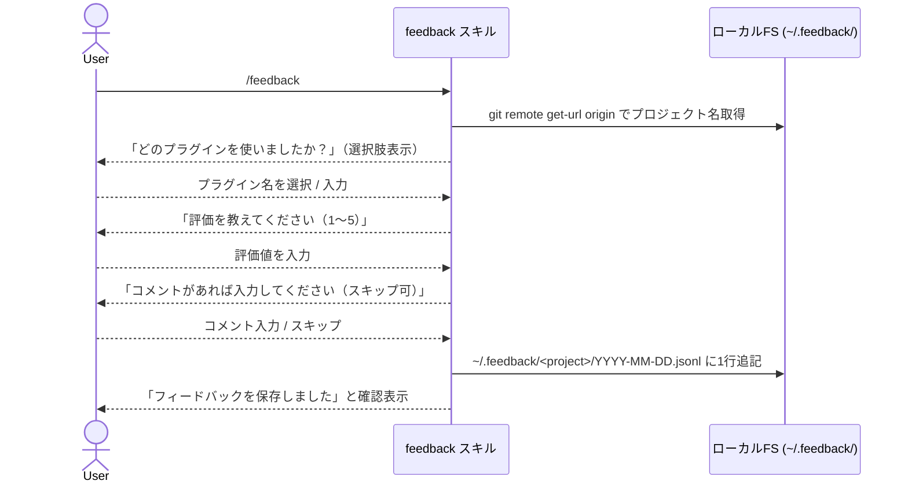
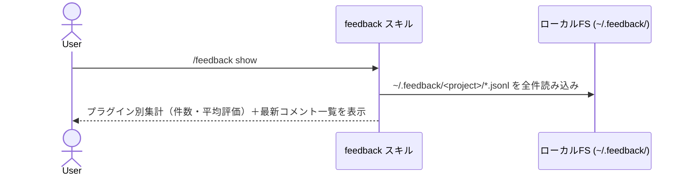
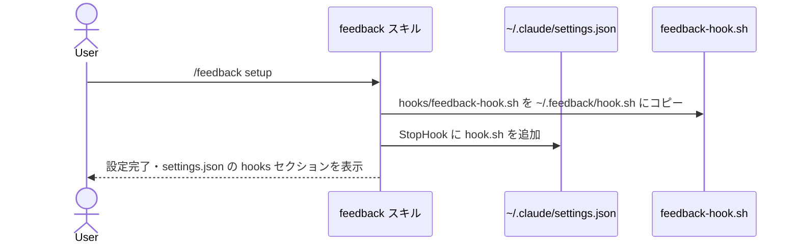

# Sequence - feedback-collection

## /feedback（フィードバック登録）

```mermaid
sequenceDiagram
    actor User
    participant Skill as feedback スキル
    participant FS as ローカルFS (~/.feedback/)

    User->>Skill: /feedback
    Skill->>FS: git remote get-url origin でプロジェクト名取得
    Skill-->>User: 「どのプラグインを使いましたか？」（選択肢表示）
    User-->>Skill: プラグイン名を選択 / 入力
    Skill-->>User: 「評価を教えてください（1〜5）」
    User-->>Skill: 評価値を入力
    Skill-->>User: 「コメントがあれば入力してください（スキップ可）」
    User-->>Skill: コメント入力 / スキップ
    Skill->>FS: ~/.feedback/<project>/YYYY-MM-DD.jsonl に1行追記
    Skill-->>User: 「フィードバックを保存しました」と確認表示
```

## /feedback show（一覧・集計）

```mermaid
sequenceDiagram
    actor User
    participant Skill as feedback スキル
    participant FS as ローカルFS (~/.feedback/)

    User->>Skill: /feedback show
    Skill->>FS: ~/.feedback/<project>/*.jsonl を全件読み込み
    Skill-->>User: プラグイン別集計（件数・平均評価）＋最新コメント一覧を表示
```

## /feedback setup（フック設定）

```mermaid
sequenceDiagram
    actor User
    participant Skill as feedback スキル
    participant Settings as ~/.claude/settings.json
    participant Hook as feedback-hook.sh

    User->>Skill: /feedback setup
    Skill->>Hook: hooks/feedback-hook.sh を ~/.feedback/hook.sh にコピー
    Skill->>Settings: StopHook に hook.sh を追加
    Skill-->>User: 設定完了・settings.json の hooks セクションを表示
```
